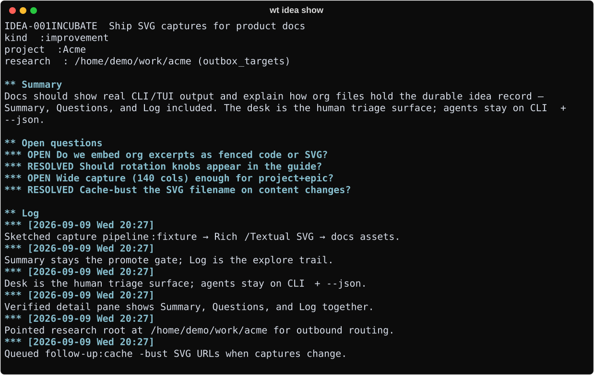

# Ideas & next

Capture seeds, enrich them, and see what to do next.

## When to use

Parking a thought without breaking flow; morning triage; agent `--json` lists.

## Commands

| Command | Role |
|---------|------|
| `wt idea TEXT` | Capture (optional `--project`, `--tag`, `--kind`) |
| `wt idea show\|summary\|log\|questions …` | Read / enrich |
| `wt idea clock-in\|clock-out` | Supplemental wall-time — [Clock](clock.md) |
| `wt idea state` | Force lifecycle keyword when needed |
| `wt ideas` | List open ideas; `--all`, `--query`, `--tree`, `--json` |
| `wt next` | Next-step hint per idea (`--all` includes build reminders) |

Open clocks show `◕` on the idea id in CLI tables (and on the desk). Ideas are seeds;
actionable one-liners belong in `wt add` — see [Tasks & agenda](tasks-agenda.md).

Workflow: [Idea → ship](../guides/idea-to-ship.md). Storage layout:
[Org-mode storage](../guides/org-storage.md).

