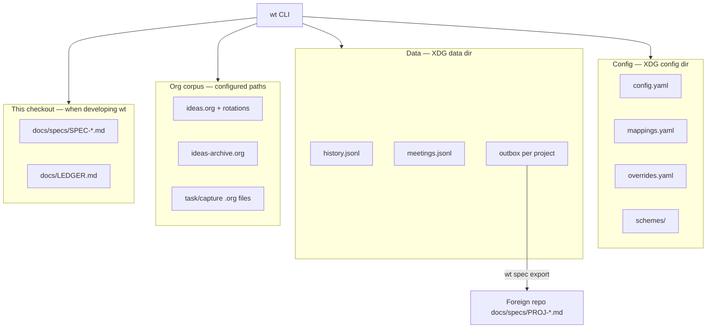
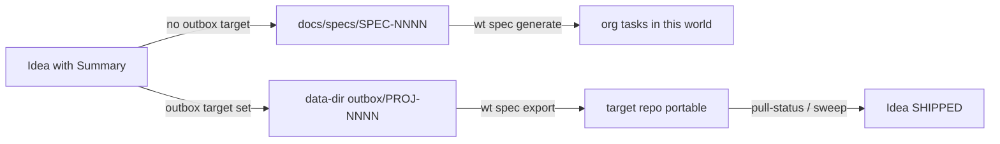

# Storage architecture

Where wt state lives. Four stores, one CLI — they do not all sit in the git checkout.

Defaults (overridable in config):

| Store | Typical path | Holds |
|-------|----------------|-------|
| Config | `~/.config/wt/` | mappings, overrides, schemes, user config |
| Data | `~/.local/share/wt/` | history, meetings, **outbox** portables |
| Org | paths in `org_files` / `org_ideas_file` | ideas + actionable tasks |
| Package specs | `docs/specs/` in the wt repo | **internal** `SPEC-NNNN` only |

## Project (three meanings)

| Sense | Where | Role |
|-------|--------|------|
| **Facet value** | `mappings.yaml` (`bucket=` / `project=`) | Groups passive hours in reports |
| **Idea association** | org `:PROJECT:` on an idea | Routes research root + outbound vs internal |
| **Outbox target** | `outbox_targets` in config | Named foreign repo for `wt spec export` |

Saying “project” without which sense is the usual source of confusion — prefer
**facet**, **idea project**, or **outbox target** in docs and skills.

## Internal vs outbound specs

- **Internal** — governing design for wt itself (or work without a foreign repo). Ledger is
  `docs/LEDGER.md`. Close with AC + test plan + `wt spec verify` → `status: done`, idea
  often `PROMOTED` then settled.
- **Outbound** — design for another repo. Source of truth while drafting is the **outbox**;
  after export the portable in the target repo is what implementers edit. Idea goes
  `EXPORTED` → `SHIPPED` when reconcile says the portable is done.

## Related

- Lifecycles and DoD: [Lifecycle](lifecycle.md)
- Time files: [Time model & retention](time-and-retention.md)
- Command walkthroughs: [Workflow architecture](workflows.md)
