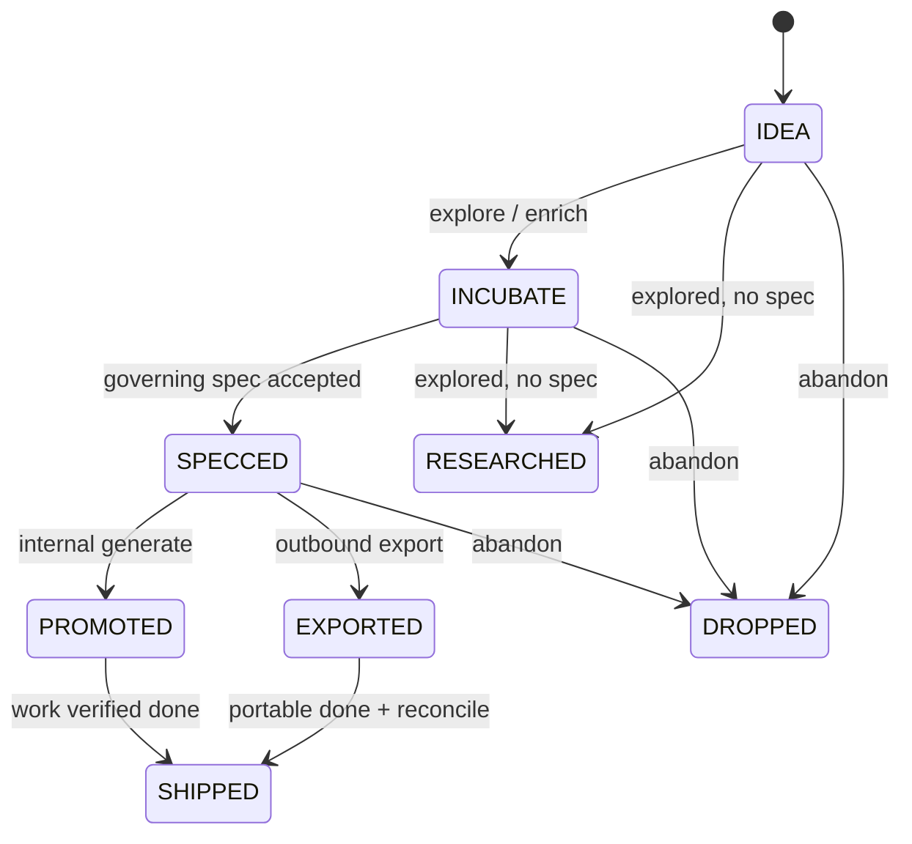
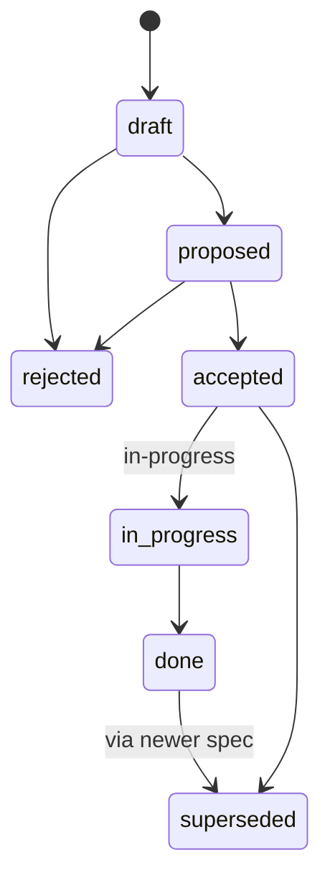

# Lifecycle & definition of done

Two state machines (idea keywords vs spec `status`) plus a close-the-loop matrix.
Keywords below match the default `org_idea_keywords` / spec schema — your config may rename
active TODO words, but the **roles** stay the same.

## Idea keywords

| Keyword | Meaning |
|---------|---------|
| `IDEA` | Captured; may still lack Summary |
| `INCUBATE` | Being enriched (Summary / questions / Log) |
| `SPECCED` | Linked governing spec is accepted |
| `PROMOTED` | Internal path: tasks generated from the spec |
| `EXPORTED` | Outbound path: portable filed in the target repo |
| `SHIPPED` | Outcome delivered; idea-level “done” |
| `DROPPED` | Abandoned |
| `RESEARCHED` | Explored on purpose **without** promoting to a spec — terminal, not a failure |

`RESEARCHED` is for “we looked; no design to accept.” It is archived with other terminal
states; it is **not** a synonym for `INCUBATE`.

Open questions on an idea should be resolved (or explicitly left open) before promote —
accepted specs that leave stale `OPEN` questions show up in reconcile.

## Spec `status`

| Status | Meaning |
|--------|---------|
| `draft` | Being written |
| `proposed` | Ready for a go/no-go |
| `accepted` | Funded to build; not started |
| `in-progress` | Implementation underway |
| `done` | Shipped; body matches reality; test plan executed |
| `superseded` / `rejected` | Historical — keep the file |

Never silently rewrite a past-`draft` decision — supersede instead (see repo `AGENTS.md`).

## Definition of done matrix

| Layer | “Done” means | Typical command / evidence |
|-------|----------------|----------------------------|
| **Spec (internal)** | Every AC true; test plan run; ledger shows `done`; body matches what shipped | `wt spec verify`, pytest, `--write-ledger` |
| **Spec (outbound portable)** | AC/test plan in the **target** repo; portable `status: done` | implement + verify in foreign checkout |
| **Idea (internal)** | Often `PROMOTED` after generate; `SHIPPED` when the outcome is truly finished | `wt spec generate`, then settle idea |
| **Idea (outbound)** | `EXPORTED` after export; **`SHIPPED` only after** pull-status/sweep shows portable done | `wt spec export`, `pull-status` / `sweep` |
| **Passive time** | N/A — hours keep accruing; “done” is mapping + snapshot hygiene | `wt map`, `wt snapshot` |
| **Clock session** | Every `clock-in` has a matching `clock-out` | `wt idea clock-out` |

**Merged code ≠ done.** A PR can land while the spec is still `in-progress` and the idea
still `EXPORTED`. Product docs and skills treat verify + reconcile as the claim-done path.

## Related

- Where files live: [Storage architecture](architecture.md)
- Day/week loops: [Daily ops](../guides/daily-ops.md) · [Weekly ops](../guides/weekly-ops.md)
- Pipelines: [Idea → ship](../guides/idea-to-ship.md) · [Outbound](../guides/outbound.md)
