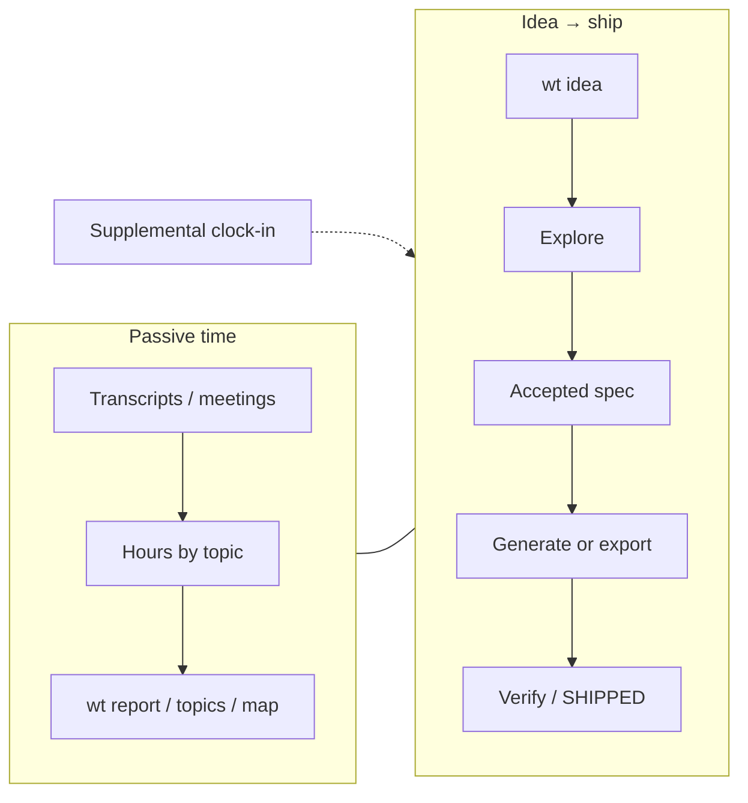
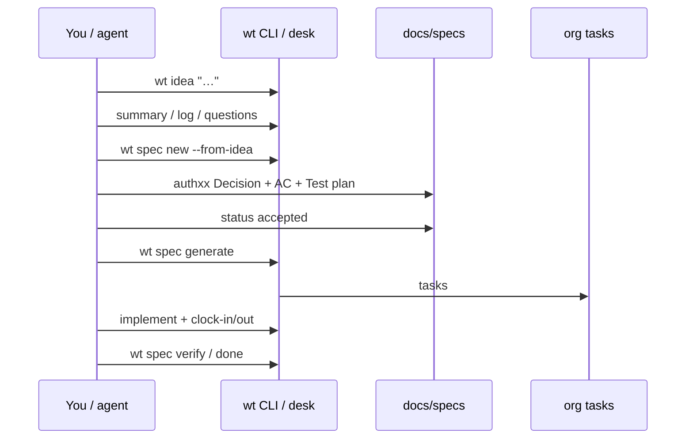
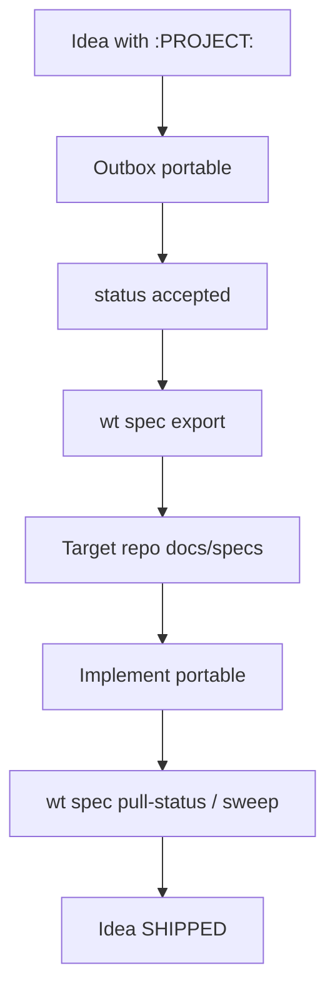
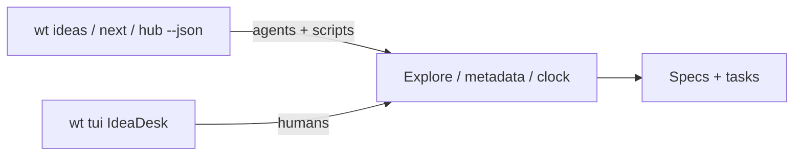

# Workflow architecture

How wt pieces connect. These are **workflow** diagrams (not code design). Diagram DSL is
Mermaid for now (SPEC-0148); D2 can replace the fences later without changing the story.

## Dual systems

Passive hours and idea→ship share the CLI and triage surfaces; clock-in is optional wall-time
on an idea while you build.

## Idea → ship (internal)

## Outbound

## Desk vs CLI

See [Idea → ship](../guides/idea-to-ship.md), [Track time](../guides/track-time.md), and
[Outbound](../guides/outbound.md) for command-level walkthroughs with live SVG captures.

Storage topology and DoD: [Architecture](architecture.md) · [Lifecycle](lifecycle.md).
