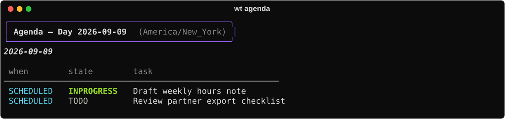
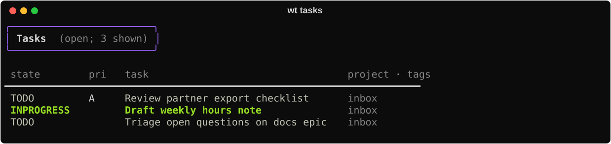
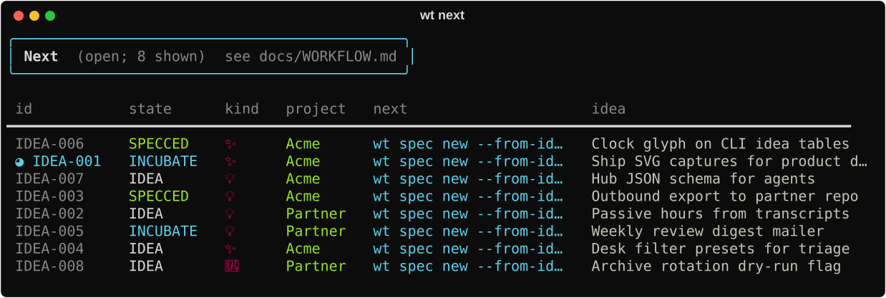
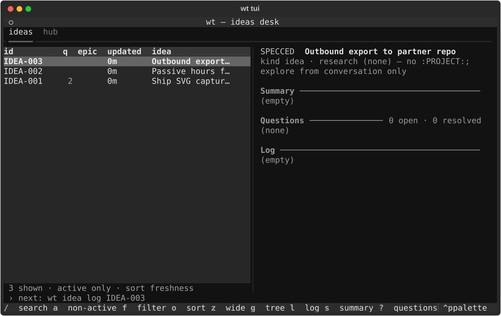

# Daily ops

A normal day with wt: dated work first, then idea triage, then a light time check.
Commands below match the live CLI; SVGs are regenerable demo fixtures (`uv run python scripts/docs-capture.py`).

## 1. What’s on the calendar

```bash
wt agenda                 # SCHEDULED / DEADLINE for today (+ overdue)
wt tasks                  # open actionable org tasks
```





Ideas are excluded from `agenda` / `tasks` by default — pass `--ideas` on agenda when you
want dated ideas in the same view.

## 2. Triage open ideas

```bash
wt next                   # one-line next step per open idea
wt ideas                  # full open set
wt hub --json             # ideas + internal specs + outbound + today tasks
```




When you sit down to implement a slice:

```bash
wt idea clock-in IDEA-…
# …work…
wt idea clock-out IDEA-…
```

That clock is **supplemental** wall-time beside passive transcripts ([Clock](../capabilities/clock.md)).

## 3. Light time pulse

```bash
wt                        # today + this week
wt report                 # today only
```


Save deep mapping and review for [Weekly ops](weekly-ops.md).

## Optional desk

```bash
wt tui                    # requires the tui extra
```


