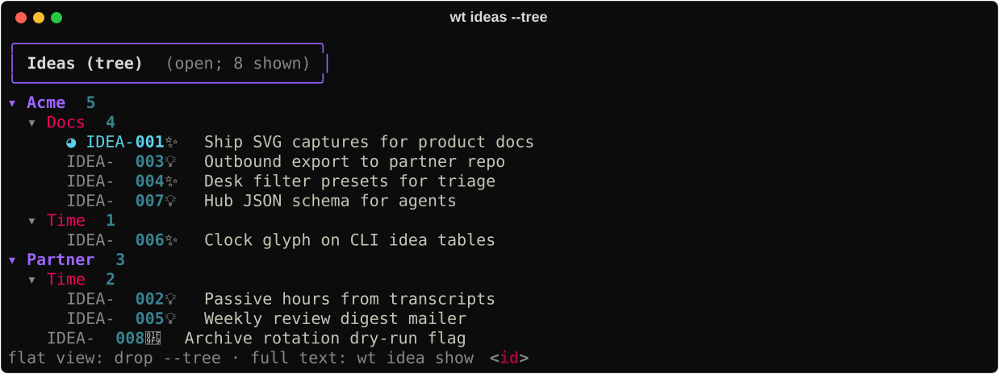
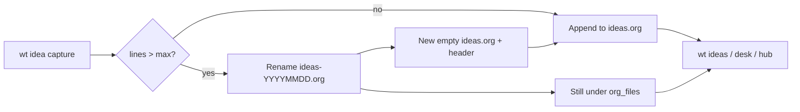

# Org-mode storage

wt does not invent a private database for ideas. It stores them as **org-mode**
headlines in plain files you can open in Emacs, Neovim, VS Code, or any text editor.
That is intentional: the same richness org already has for TODO states, properties,
drawers, clocks, and outline nesting becomes wt’s durable record.

Agents and the CLI speak JSON; **humans can still read and edit the files**.

## Where files live

| Config key | Default (typical) | Role |
|------------|-------------------|------|
| `org_files` | `~/work/org` (dir or list) | **Read** corpus — recursive `*.org` |
| `org_ideas_file` | `~/work/org/ai/ideas.org` | **Write** target for new captures |
| `org_ideas_archive_file` | `~/work/org/ai/ideas-archive.org` | Terminal ideas move here |
| `idea_rotation_max_lines` | `1200` | Rotate active ideas file when oversized |

Capture always appends to `org_ideas_file`. Listing (`wt ideas`, desk, hub) scans
everything under `org_files`, so **rotated** dated siblings and the **archive** stay
visible without changing config paths.

## File shape

### Header

Idea files declare their own TODO vocabularies:

```org
#+TODO: IDEA INCUBATE SPECCED | PROMOTED EXPORTED SHIPPED DROPPED
#+TODO: OPEN | RESOLVED
```

The second line appears once questions are written (`OPEN` / `RESOLVED` under
`** Open questions`).

### Headline + properties

Each idea is a **level-1** headline with a stable `:ID:`:

```org
* INCUBATE Ship SVG captures for product docs
  :PROPERTIES:
  :ID: IDEA-001
  :CREATED: [2026-09-09 Wed 18:30]
  :UPDATED: [2026-09-09 Wed 18:30]
  :END:
```

Optional properties include `:PROJECT:`, `:KIND:`, `:SPEC:`, `:EXPLORED:`, …

### Enrichment outline

Under the headline, wt keeps a fixed skeleton (order matters):

1. `** Summary` — durable prose; **gates promotion**
2. `** Open questions` — `*** OPEN|RESOLVED …` child headlines
3. `** Log` — `*** [stamp]` entries (CLI: `wt idea log`; formerly `explore`)

Supplemental wall-time uses org’s native `:LOGBOOK:` / `CLOCK:` **beside** that outline
(not inside `** Log`) — see [Clock](../capabilities/clock.md).

### Full demo file

The capture script seeds this committed fixture (open it in an editor):
[`ideas-demo.org`](../assets/examples/ideas-demo.org).

```org
#+TODO: IDEA INCUBATE SPECCED | PROMOTED EXPORTED SHIPPED DROPPED
#+TODO: OPEN | RESOLVED

* INCUBATE Ship SVG captures for product docs
  :PROPERTIES:
  :ID: IDEA-001
  :CREATED: [2026-09-09 Wed 18:30]
  :UPDATED: [2026-09-09 Wed 18:30]
  :END:
** Summary
Docs should show real CLI/TUI output and explain how org files hold the durable idea record.
** Open questions
*** OPEN Do we embed org excerpts as fenced code or SVG?
*** OPEN Should rotation knobs appear in the guide?
** Log
*** [2026-09-09 Wed 18:30]
Seeded demo enrichment for product-doc captures.
*** [2026-09-09 Wed 18:30]
Summary gates promote; Log holds the explore trail.
* IDEA Passive hours from transcripts
  :PROPERTIES:
  :ID: IDEA-002
  :CREATED: [2026-09-09 Wed 18:30]
  :UPDATED: [2026-09-09 Wed 18:30]
  :END:
* SPECCED Outbound export to partner repo
  :PROPERTIES:
  :ID: IDEA-003
  :CREATED: [2026-09-09 Wed 18:30]
  :UPDATED: [2026-09-09 Wed 18:30]
  :END:
```

## What the CLI writes

| Command | Mutates org? | Effect |
|---------|--------------|--------|
| `wt idea "…"` | Yes | Append headline + `:ID:` to `org_ideas_file` (may rotate first) |
| `wt idea summary` | Yes | Replace `** Summary` body |
| `wt idea log` | Yes | Append stamped entry under `** Log`; may `IDEA`→`INCUBATE` |
| `wt idea questions …` | Yes | Mutate `** Open questions` |
| `wt idea show` | No | Render the outline |
| `wt idea clock-in/out` | Yes | `:LOGBOOK:` CLOCK lines |


Also from the same fixture:





## Rotation

When `org_ideas_file` exceeds `idea_rotation_max_lines`, the **next capture**:

1. Renames the active file to `ideas-YYYYMMDD.org` (same directory; `-N` if needed)
2. Writes a fresh header-only file back at the configured `org_ideas_file` path

Config path never changes. Old windows remain loadable because they still sit under
`org_files`. Example sibling:
[`ideas-20260901.org`](../assets/examples/ideas-20260901.org).



## Archive

Moving to a **terminal** idea state (for example DROPPED, PROMOTED, SHIPPED) cuts the
whole level-1 subtree into `org_ideas_archive_file`. There is no separate
`wt idea archive` verb — state transitions drive it.

Example stub: [`ideas-archive-demo.org`](../assets/examples/ideas-archive-demo.org).

## Why this matters

- **Predictable structure** — agents and skills know where Summary / questions / Log live.
- **Human-editable** — fix a typo in your editor; wt re-reads on the next command.
- **History without a DB** — rotation + archive keep the active file small while IDs stay
  stable across files.

Related: [Idea → ship](idea-to-ship.md) · [Getting started](getting-started.md) ·
[Workflow architecture](../concepts/workflows.md) · [Ideas capability](../capabilities/ideas.md).
