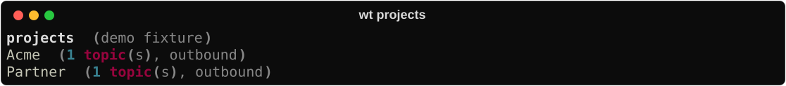
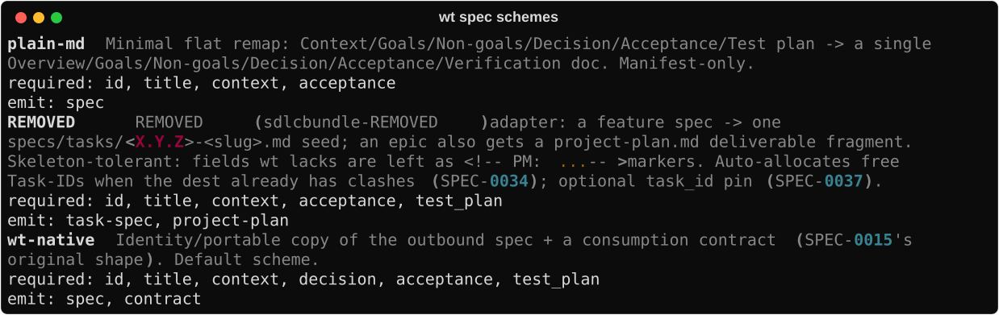

# Outbound

Ship work into **another** repo. The portable in that tree is what implementers edit;
wt’s outbox keeps a draft + the idea’s lifecycle. Closing the loop is **required**, not
optional.


## 1. Register the project

```bash
wt projects list --json
wt projects add Acme --repo ~/work/acme          # dry-run plan
wt projects add Acme --repo ~/work/acme --yes    # write outbox_targets
```



`repo_path` is both the **export destination** and the explore **research root**. Stubs
without a repo stay non-outbound until you add one.

To **rename the bucket** (config key + `<data_dir>/outbox/OLD` + idea `:PROJECT:` / Ext
headlines), use `wt projects rename OLD NEW` (dry-run) then `--yes`. That is different from
`projects add` retargeting the same key’s `repo_path`. In v1, outbound ids and filenames
stay as minted (e.g. `DEMO-0001` under the new folder); future mints use the new
bucket’s code. Target-repo portable rewrite / id rekey is not part of rename.

## 2. Capture with `:PROJECT:`

```bash
wt idea "…" --project Acme
# explore Summary / questions / Log as usual
wt spec new --from-idea IDEA-00N     # → data_dir/outbox/Acme/ACME-NNNN.md
```

Force an internal SPEC in this wt checkout instead: `--internal`.

## 3. Accept, then export (never generate)

Do **not** `wt spec generate` on outbound portables — that path is for internal SPECs.

```bash
# edit outbox portable → status: accepted
wt spec schemes                      # wt-native (default), plain-md, REMOVED, …
wt spec export ACME-NNNN             # scheme from outbox_targets or --scheme
# idea → EXPORTED; file lands in target docs/specs/
```



## 4. Implement in the target repo

In the foreign checkout: drive AC + Test plan on the portable (skill `/wt-implement-spec`
if skills are installed there). Prefer the portable’s status/`done` as source of truth.

## 5. Required close-the-loop

Leaving the idea on `EXPORTED` after the portable is `done` is **debt**.

```bash
wt spec pull-status ACME-NNNN        # mirror portable status → outbox + idea
wt spec sweep                        # bulk pull-status/pull-clock for pending exports
# when portable is done → idea must become SHIPPED
wt idea show IDEA-00N                # confirm SHIPPED
```

Stuck on `EXPORTED` while the portable is already `done` → run `pull-status` (or `sweep`),
then fix any reconcile complaints (`wt spec reconcile`). Do not archive the idea as
`RESEARCHED` to hide outbound debt.

Optional after ship:

```bash
wt spec fit-log ACME-NNNN --note "…"
```

## Schemes (short)

| Scheme | Role |
|--------|------|
| `wt-native` | Default portable + contract |
| `plain-md` | Flat remap for simple foreign layouts |
| `REMOVED` | REMOVED seed + optional project-plan fragment |

`wt spec schemes` lists required fields and emit artifacts.

## Related

- Fan-out epics: [Multi-project](multi-project.md) (`seed-children`)
- DoD matrix: [Lifecycle](../concepts/lifecycle.md)
- Weekly hygiene: [Weekly ops](weekly-ops.md)
- Capability: [Projects](../capabilities/projects.md)
