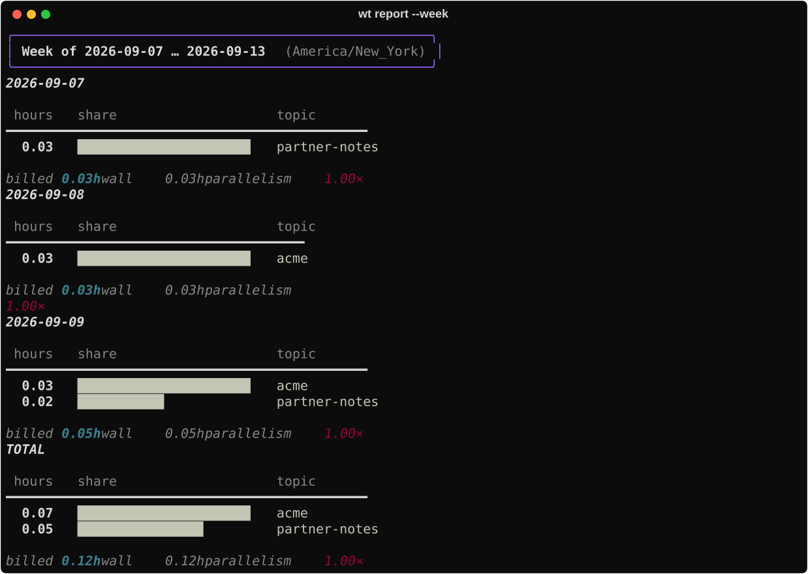
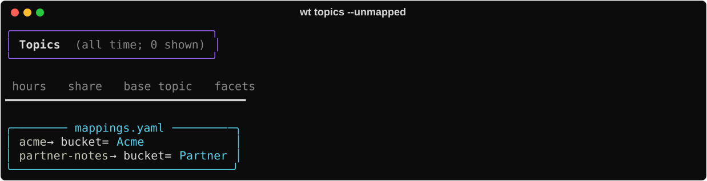
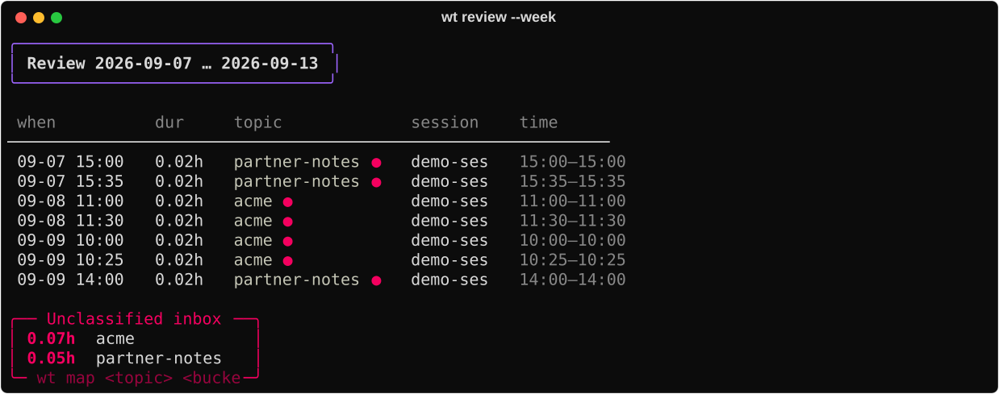
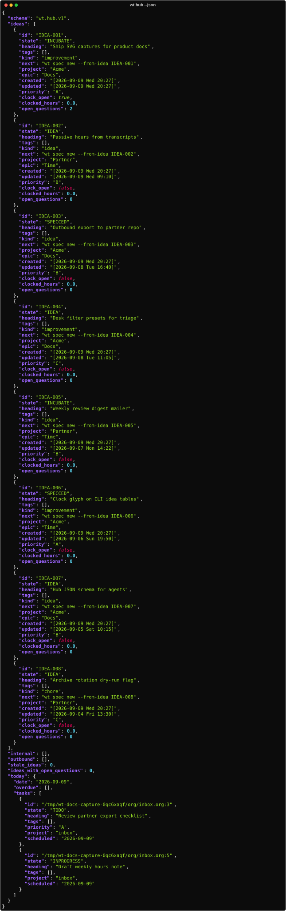

# Weekly ops

Close the week: name unknown topics, sanity-check segments, archive history, and don’t
leave idea/spec loops half-closed.

## 1. Hours this week

```bash
wt report --week
wt report --week --by bucket    # or project / other facet axis you use
```



## 2. Map the unknowns

```bash
wt topics --unmapped
wt map <base-topic> bucket=Acme area=docs
```




Bare `wt map topic Acme` is shorthand for `bucket=Acme`.

## 3. Review segments

```bash
wt review --week            # timeline + unclassified inbox
wt review --week --fix   # map interactively when you want
```



## 4. Keep history

Claude Code deletes old transcripts. Snapshot closed days before they vanish:

```bash
wt snapshot                 # through yesterday by default
```

## 5. Idea / outbound hygiene

```bash
wt hub --json               # stale ideas, open questions, outbound debt
wt next
wt idea questions IDEA-… --resolve N   # clear what the accepted spec decided
```



For work exported to another repo, treat **pull-status / sweep → idea SHIPPED** as required
close-the-loop (see [Outbound](outbound.md)) — not an optional footnote. Multi-repo epics:
[Multi-project](multi-project.md) (`seed-children`).

## Related

- Day rhythm: [Daily ops](daily-ops.md)
- Deeper time model: [Track time](track-time.md) · [Time & retention](../concepts/time-and-retention.md)
