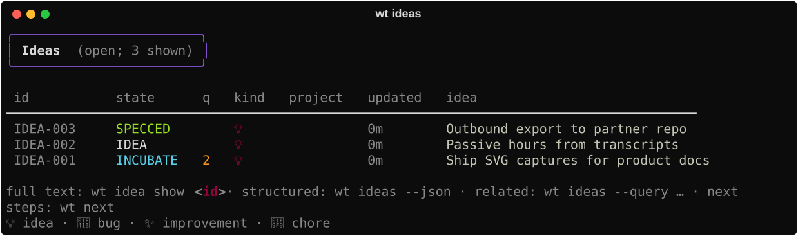
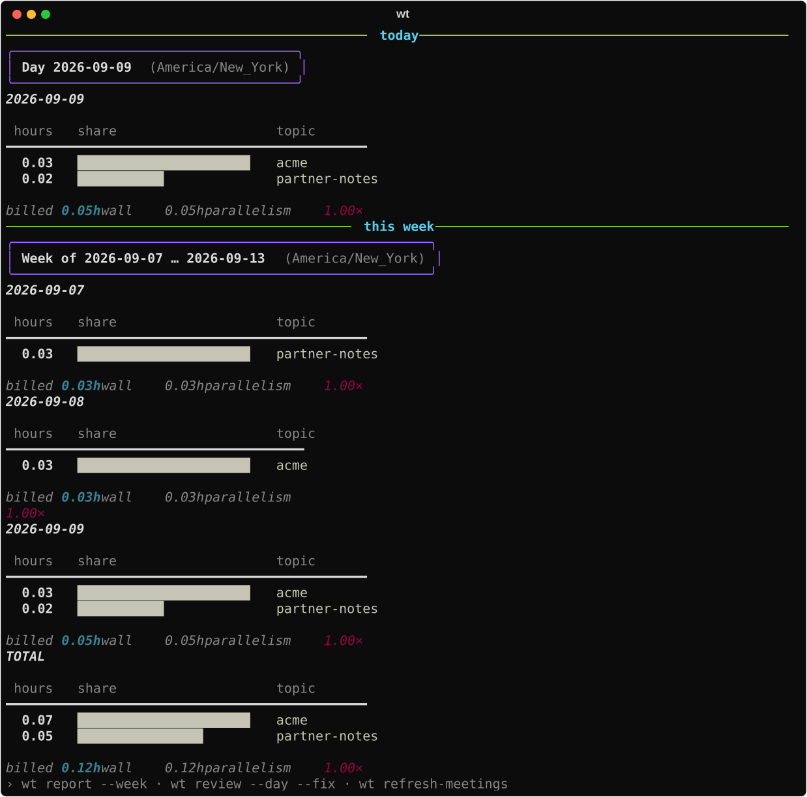

# wt

**wt** helps you park work thoughts, run them through a short governing-spec lifecycle, and
see the hours around that work.

You meet it as:

- a **command-line** tool (`wt ideas`, `wt next`, `wt hub`, `wt report`, …)
- an optional interactive **ideas desk** (`wt tui`)
- agent/automation surfaces (`--json`, installable skills)

## What it covers

1. **Ideas & lifecycle** — capture and triage (catalog, filter, next-step), then promote
   what matters into a short **governing spec** (Acceptance criteria + Test plan). Build
   against that brief; **verify** before you call it done (`wt spec verify` /
   `/wt-verify`). Same shape when you [export](guides/outbound.md) into another repo
   ([default portable](concepts/portable-default.md)).
2. **Passive time** — hours per topic from Claude Code / Cursor transcripts (and meetings).
   No timer for that signal.

```text
idea → explore → accepted spec → build → verify
```






`wt idea clock-in` / `clock-out` is **supplemental** wall-time while you build a slice — it
does not replace passive tracking ([Clock](capabilities/clock.md)). Desk details:
[Desk (TUI)](capabilities/tui.md).

## Start here

| If you want to… | Go to |
|-----------------|--------|
| Install and pick a first path | [Getting started](guides/getting-started.md) |
| Capture → spec → verify | [Idea → ship](guides/idea-to-ship.md) |
| Hand work to another repo | [Outbound](guides/outbound.md) |
| Use the ideas desk | [Desk (TUI)](capabilities/tui.md) |
| Drive wt from an agent | [Agent surface](guides/agent-surface.md) |
| Dig into hours | [Track time](guides/track-time.md) |
| Day / week rhythm | [Daily ops](guides/daily-ops.md) · [Weekly ops](guides/weekly-ops.md) |

## Also

- [Concepts](concepts/index.md) · [Capabilities](capabilities/index.md) · [Reference](reference/index.md) · [Contribute](contribute/index.md)
